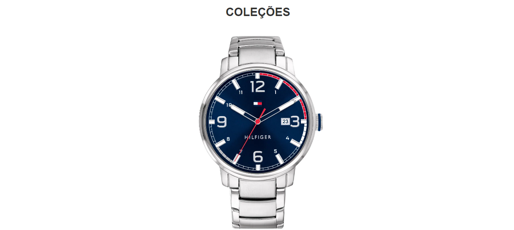
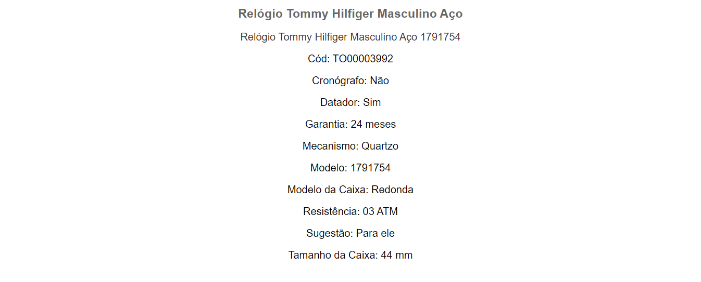
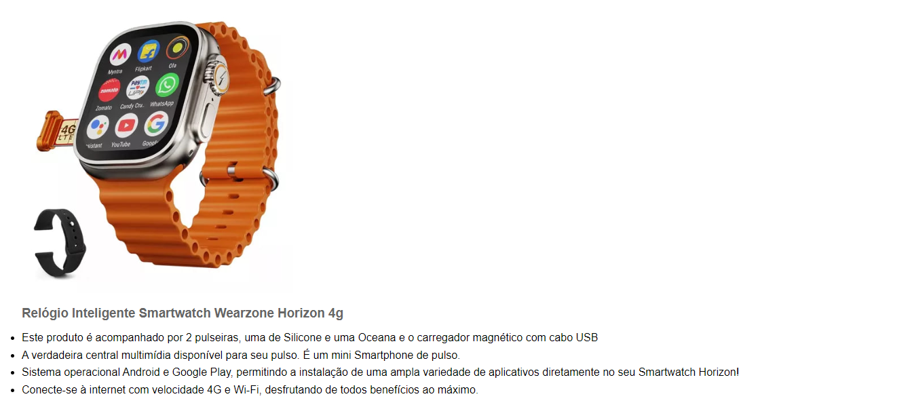
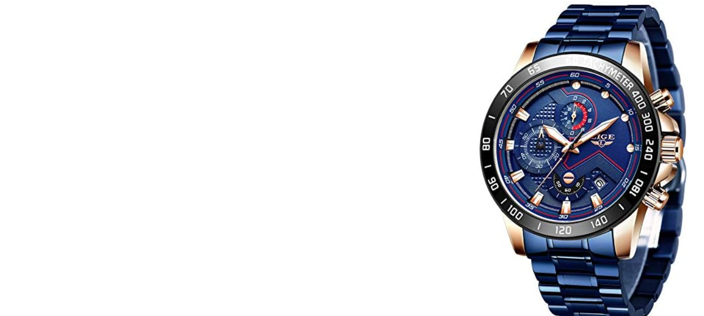
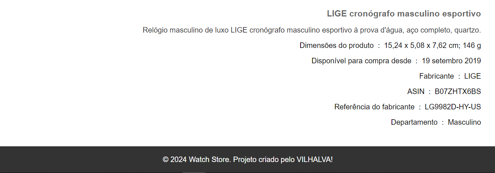

# LOJA DE RELOGIOS COM SCSS
👨‍🏫INTERFACE "LOJA DE VENDA DE RELOGIOS" COM HTML/CSS/SCSS.

 <br>
 <br>
 <br>
 <br>
 <br>
 <br>

## DESCRIÇÃO
Este é um aplicativo web de uma loja de vendas de relógios, onde os usuários podem visualizar uma coleção de relógios disponíveis para compra. A página inclui detalhes e descrições dos produtos, imagens e links para compras externas. O site utiliza HTML para estrutura e conteúdo, e SCSS para estilização, garantindo um design moderno e responsivo.

1. **Visualização de Produtos**:
   - A seção principal apresenta uma coleção de relógios, com imagens, títulos e descrições detalhadas.
   - Cada produto possui uma lista de características específicas sem marcadores, facilitando a leitura das especificações.

2. **Detalhes dos Produtos**:
   - **Relógio Tommy Hilfiger Masculino Aço**:
     - Descrição detalhada incluindo código, cronógrafo, datador, garantia, mecanismo, modelo, resistência, sugestão de uso e tamanho da caixa.
   - **Relógio Inteligente Smartwatch Wearzone Horizon 4G**:
     - Lista de características principais, incluindo pulseiras, carregador, sistema operacional, conectividade e funcionalidades.
   - **LIGE Cronógrafo Masculino Esportivo**:
     - Detalhes do produto, incluindo dimensões, data de disponibilidade, fabricante, referência e departamento.

3. **Rodapé**:
   - Inclui uma mensagem de direitos autorais e a autoria do projeto.

## EXECUTANDO O PROJETO:
1. **Apenas Executar:**
   - Para usá-lo, basta apenas executar o arquivo: `./CODIGO/index.html` no navegador da sua preferência.
   - Acesse a página inicial onde encontrará o título "VENDA DE RELÓGIOS" no cabeçalho.
   - Utilize a barra de navegação para acessar diferentes seções da loja. Os links direcionam para produtos específicos:
     - **Tommy**: Redireciona para um relógio Tommy Hilfiger.
     - **Smartwatch**: Redireciona para um relógio inteligente Wearzone Horizon 4G.
     - **LIGE**: Redireciona para um relógio cronógrafo masculino da LIGE. 

2. **Editar o CSS:**
   - Para Compilar o SCSS para CSS, Apague os arquivos `./CODIGO/css/main.css` e `./CODIGO/css/main.css.map`, Execute o comando no terminal (Dentro do diretório `./CODIGO`):
   ```bash
   sass --watch scss:css
   ```

## NÃO SABE?
- Entendemos que para manipular arquivos em `HTML`, `CSS` e outras linguagens relacionadas, é necessário possuir conhecimento nessas áreas. Para auxiliar nesse aprendizado, oferecemos cursos gratuitos disponíveis:
* [CURSO DE HTML E CSS](https://github.com/VILHALVA/CURSO-DE-HTML-E-CSS)
* [CURSO DE SCSS](https://github.com/VILHALVA/CURSO-DE-SCSS)
* [CONFIRA MAIS CURSOS](https://github.com/VILHALVA?tab=repositories&q=+topic:CURSO)

## CREDITOS:
- [PROJETO CRIADO PELO VILHALVA](https://github.com/VILHALVA)
